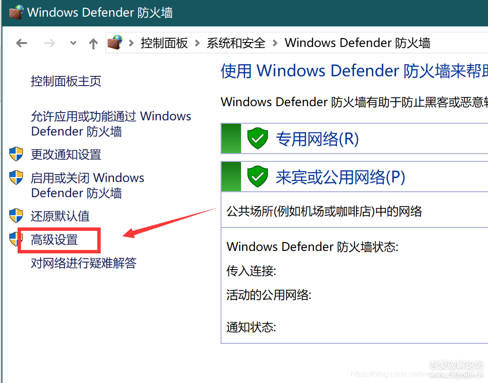
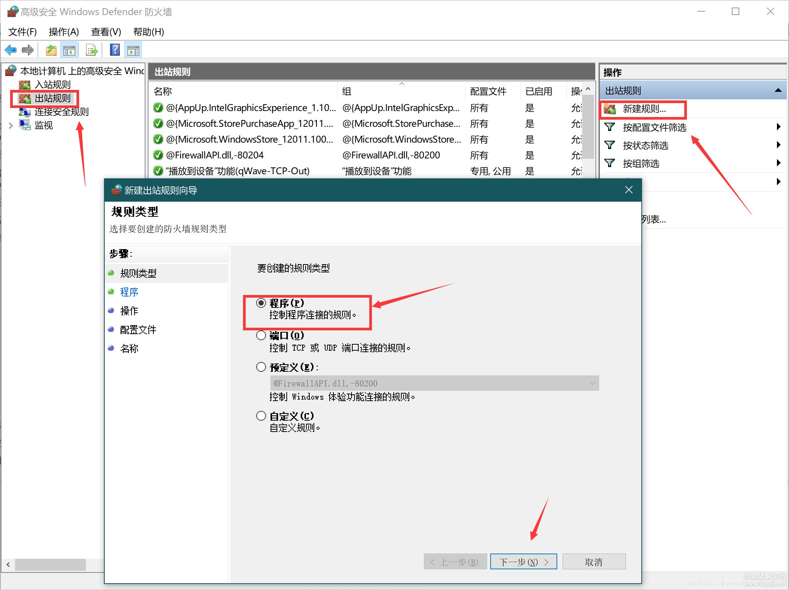
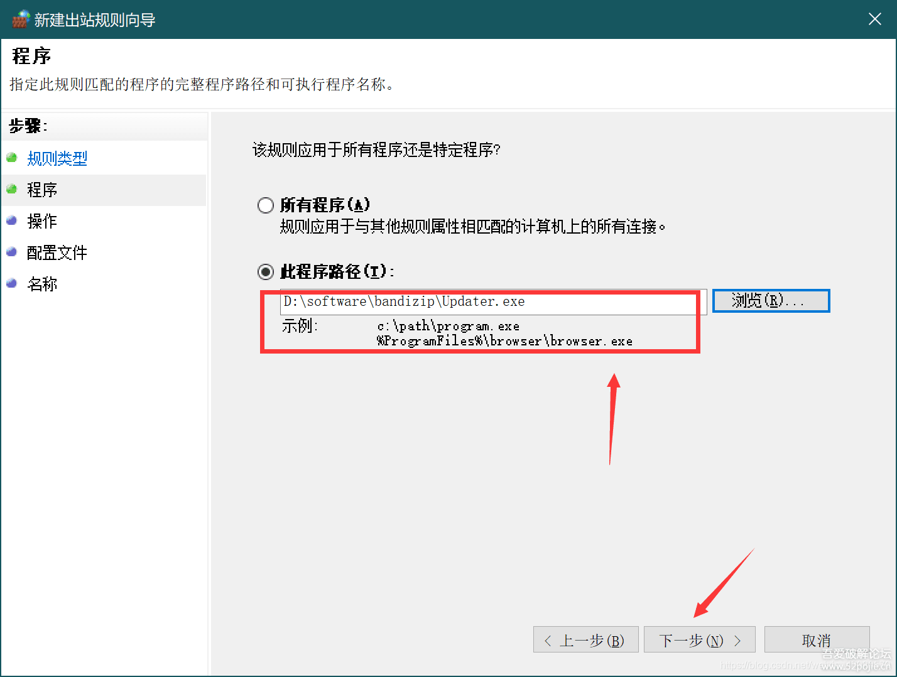
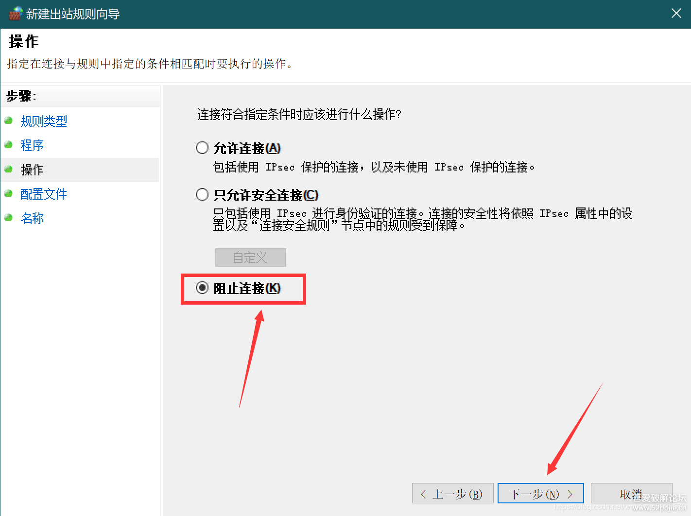

> Bandzip最后的免费无广告版本

## 下载
[点击下载-蓝奏云](https://txyz.lanzoue.com/iATfV0ylmu1e) 密码:4y0r


## 去更新弹窗

### 方法一：修改防火墙规则





### 方法二：修改注册表
```bat
:: v6 禁自动更新
reg add HKCU\Software\Bandizip /f /v bCheckUpdate /t REG_DWORD /d 0

:: v7 禁自动更新
reg add HKCU\Software\Bandizip /f /v update /t REG_DWORD /d 2
```

### 方法三：删除更新文件
去安装目录下删除Updater文件。


## 链接
- [52pojie-Windows Bandzip6.29 最后的无广告免费版（非破解）](https://www.52pojie.cn/forum.php?mod=viewthread&tid=1609663)
- [官网-bandisoft: Bandizip](https://www.bandisoft.com/bandizip/)
