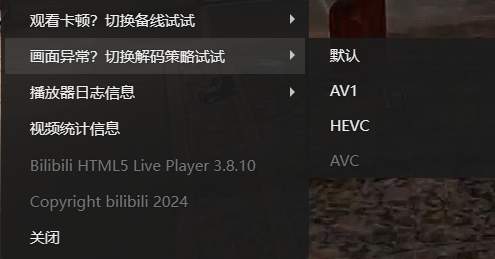

## 问题描述
仅在使用浏览器在直播间内观看直播时卡顿甚至卡死，严重情况下会弹出直播错误，但是弹幕正常滚动，在相同网络环境下手机端可以正常播放，bilibili直播首页可以正常观看其它直播推送，在直播放在后台时可以正常听到直播声音，返回前台瞬间正常播放，之后继续卡顿，卡顿时CPU持续高占用。

## 解决方法

### 法一
删除 `class="web-player-inject-wrap"` 的 `div` 标签，即可点击左下角的刷新即可。（ `F12` 进入元素选项卡，`Ctrl` + `F` 搜索 `web-player-inject-wrap` 后选中对应div然后按下Delete删除）（页面刷新后失效）

### 法二※
切换解码策略为 `AVC` 。

### 法三
禁用或卸载可能造成影响的插件，如：`EndNote Click`

---
- [瑞星化工厂-2023年12月以来Bilibili直播卡顿问题](https://www.bilibili.com/read/cv28646526/)
