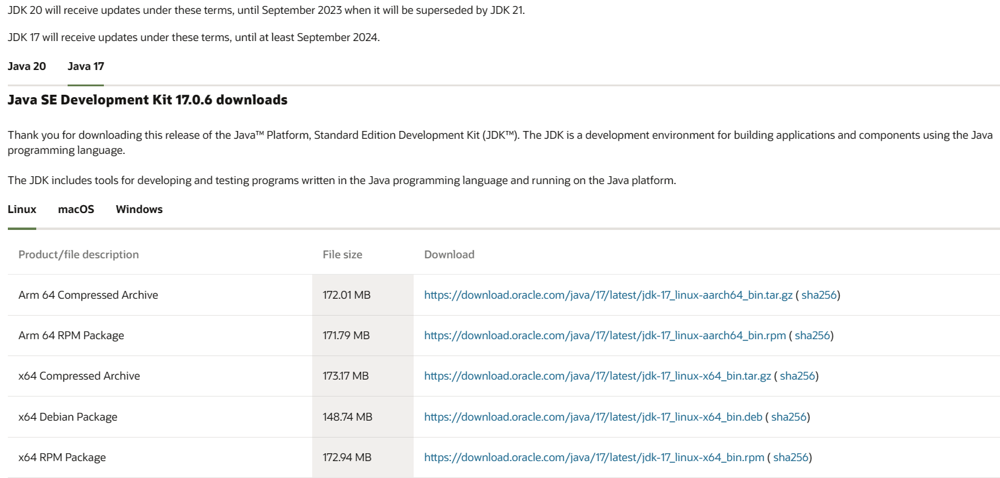

## 下载jdk
[下载页面](https://www.oracle.com/java/technologies/downloads/)



选择：x64 Compressed Archive 【根据自己的系统选择】

```
cd /usr/local/java
wget https://download.oracle.com/java/17/latest/jdk-17_linux-x64_bin.tar.gz
```

> 如果下载速度慢可考虑先从浏览器下载到主机再通过ftp工具上传到目录。 【推荐一个[工具](https://www.hostbuf.com/)（[Win](http://www.hostbuf.com/downloads/finalshell_install.exe)）（[mac](http://www.hostbuf.com/downloads/finalshell_install.pkg)）】

## 解压
```
tar -zxvf jdk-17_linux-x64_bin.tar.gz
```

## 配置环境变量
```
vim /etc/profile
```

编辑profile文件，在末尾添加：
```
export JAVA_HOME=/usr/local/java/jdk-17.0.6
export PATH=$PATH:$JAVA_HOME/bin
```

保存退出，刷新profile
```
source /etc/profile
```

## 测试
```
java -version
```
