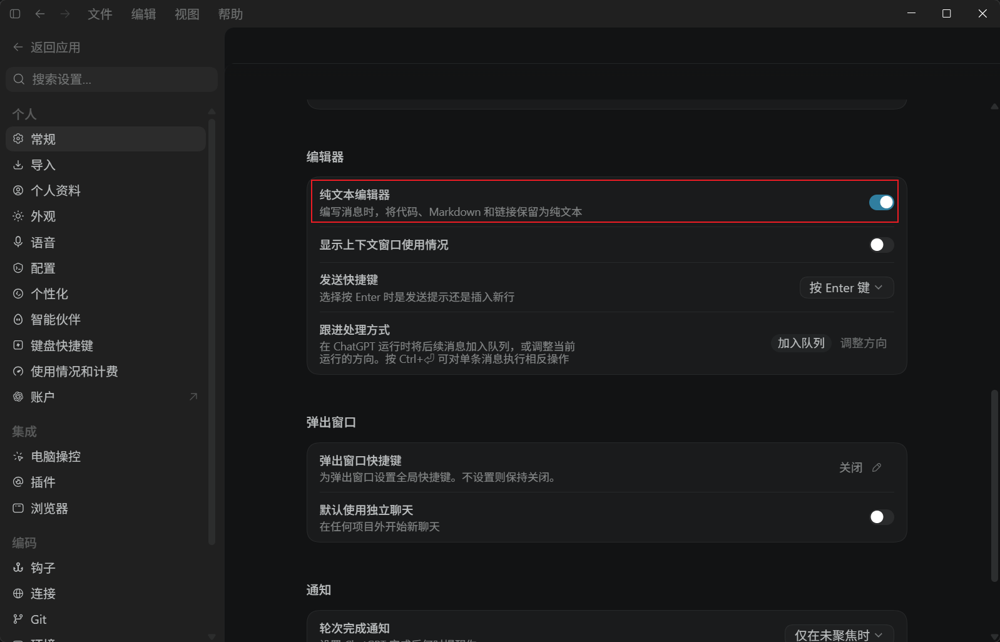

# Codex Windows 路径粘贴转义问题

## 问题现象

在 Codex Windows 桌面应用的消息输入框中粘贴路径时，富文本编辑器可能对下划线进行 Markdown 转义，导致路径中的 `_` 变成 `\_`。

例如：

```text
C:\work\my_project\test_file.py
```

可能被转换成：

```text
C:\work\my\_project\test\_file.py
```

新增的反斜杠并不是原路径的一部分，可能导致 Codex 无法正确识别文件。

## 解决方案

启用 Codex 的“纯文本编辑器”即可解决这个问题。

1. 在 Codex Windows 桌面应用中按 `Ctrl+,` 打开设置。
2. 找到“纯文本编辑器”。
3. 打开该开关。



该设置会在编写消息时将代码、Markdown 和链接保留为纯文本。开启后重新粘贴路径，路径中的下划线将保持原样，不再被自动添加 Markdown 转义符。
