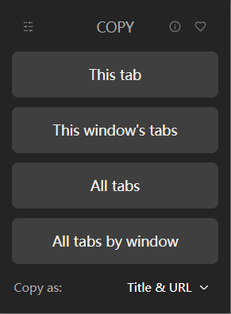

## 来自 [博客园](https://www.cnblogs.com/skyvalley/p/14492831.html)

1. 打开设置（Alt+F g）

2. 打开启动时

3. 点击使用所有已打开的标签页

4. 选中复制就可以了（Ctrl+C）

但是Edge更新之后找不到入口了。

## TabCopy 扩展

- [Chrome 应用商店](https://chromewebstore.google.com/detail/tab-copy/micdllihgoppmejpecmkilggmaagfdmb)

选择 `Title & URL`，就和上面的是一样的，而且还支持其他格式。

