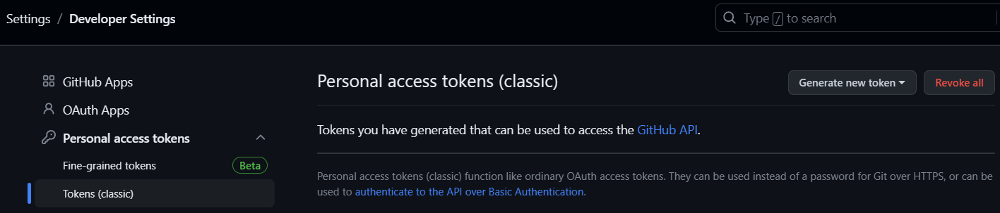
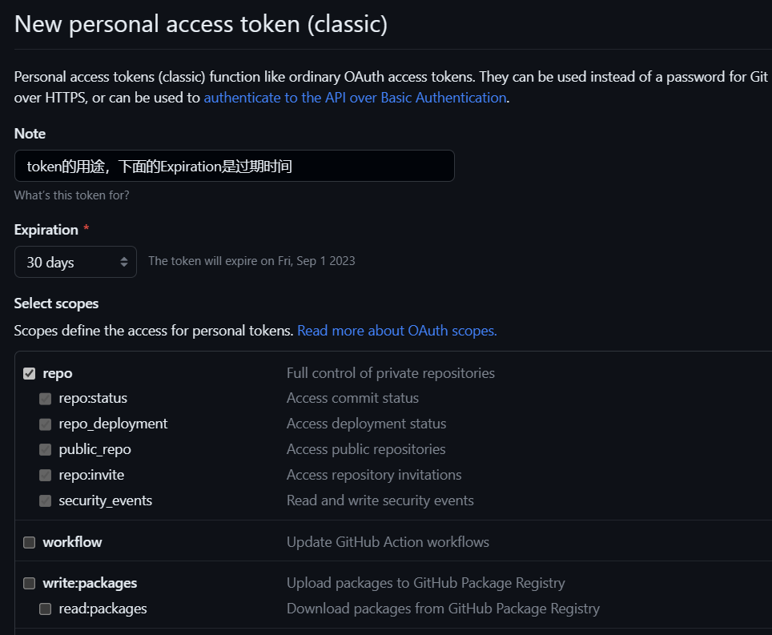
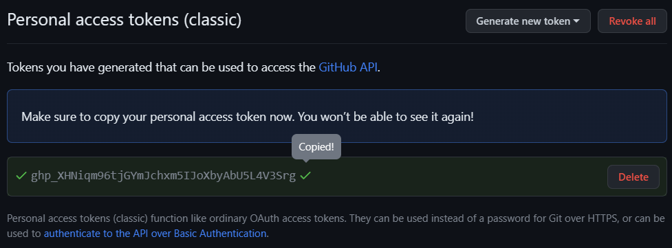

## 报错信息
```bash
$ git pull
remote: Support for password authentication was removed on August 13, 2021. Please use a personal access token instead.
remote: Please see https://github.blog/2020-12-15-token-authentication-requirements-for-git-operations/ for more information.
fatal: unable to access 'https://github.com/<USERNAME>/<REPO>.git': The requested URL returned error: 403
```

## 原因
Github自从21年8月13后不再支持用户名密码的方式验证了，需要创建个人访问令牌(personal access token)。

## 解决

### 1.生成令牌




作用域scopes按需选择，如果是自己用为了方便可以全选。

### 2.复制并妥善保存（只会显示这一次，不保存就看不到了）


### 3.使用令牌

#### 修改现有仓库
```bash
git remote set-url origin  https://<your_token>@github.com/<USERNAME>/<REPO>.git
```

#### 克隆新的仓库
```bash
git clone https://<TOKEN>@github.com/<user_name>/<repo_name>.git
```
