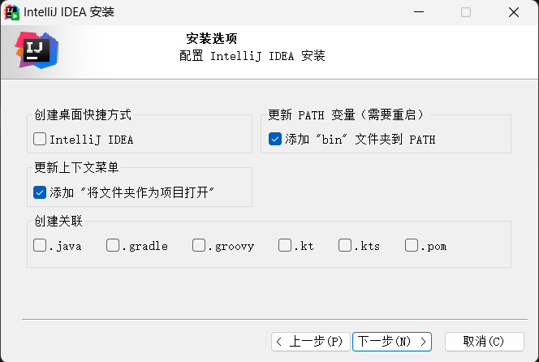

## 下载
[jetbrains官方下载地址](https://www.jetbrains.com/zh-cn/idea/download/)

直接安装即可

## 激活
见 https://www.idejihuo.com/

## 插件推荐（待完善）
| 插件名                             | 说明                    |
| ---------------------------------- | ----------------------- |
| Chinese (Simplified) Language Pack | 中文语言包              |
| Smart Input                        | 自动切换输入法          |
| MybatisX                           | Mybatis代码提示插件     |
| Maven Helper                       | maven依赖查看           |
| maven-search                       | maven依赖搜索           |
| Key Promoter X                     | 快捷键提示              |
| GenerateAllSetter                  | 生成所有setter方法      |
| GenerateSerialVersionUID           | 生成serialVersionUID    |
| GsonFormatPlus                     | Json转JavaBean          |
| Github Copilot                     | AI代码提示              |
| JBLJavaToWeb                       | 将Java模块转换为Web工程 |
| jclasslib Bytecode Viewer          | 字节码查看器            |
| LeetCode Editor                    | LeetCode编辑器          |
| .ignore                            | 生成ignore文件          |
| VSCode Theme                       | VSCode主题              |
| vo2dto                             | x.setXXX(x.getXXX())    |

