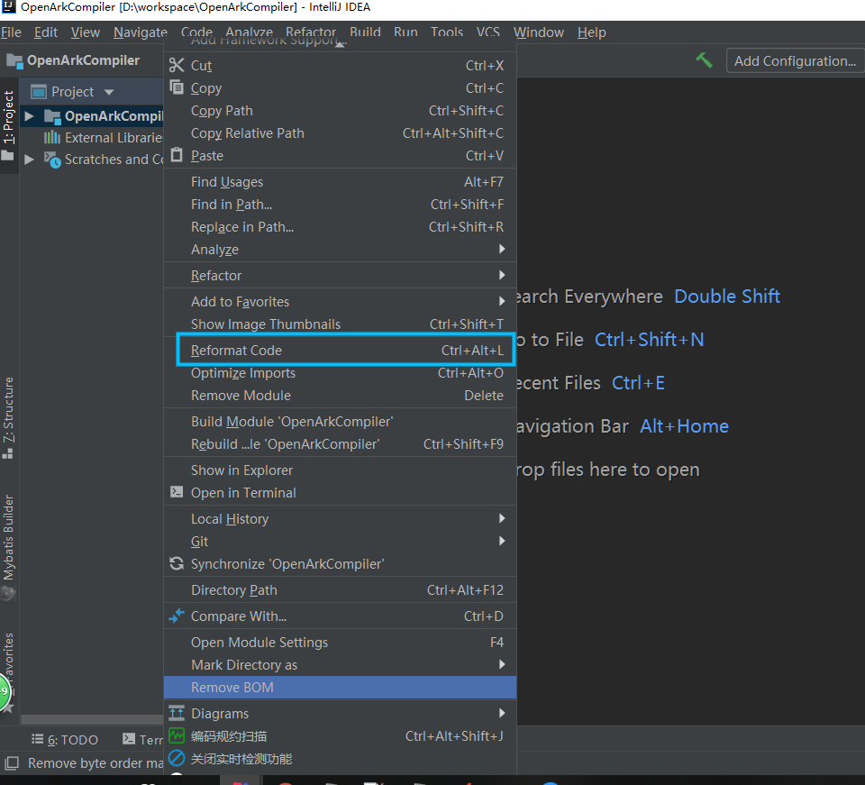

1. 单个文件打开后，直接快捷键Ctrl+Alt+L就可将当前文件格式化

2. 快捷键Ctrl+Alt+O可将import格式化（删除无用的import）

3. 如果需要格式化整个项目的所有代码，在项目名上右键，找到Reformat Code单击即可，参考如下图：
   

> 注意：此方法会将选中的整个项目下的所有文件全部格式化，包含xml等，有的xml文件会被强制换行显示导致出现BUG，

> 例如：日志log.xml日志输出格式被强制换行，会导致部分日志输出丢失！请根据实际情况谨慎使用。

> 建议：养成良好编码习惯，每次写完代码就格式化当前.java文件，其他类型文件格式化后注意其格式是否满足实际需求。

---
- [IDEA格式化项目中所有文件的方法 - 下午喝什么茶 - 博客园](https://www.cnblogs.com/hbuuid/p/11468578.html)
