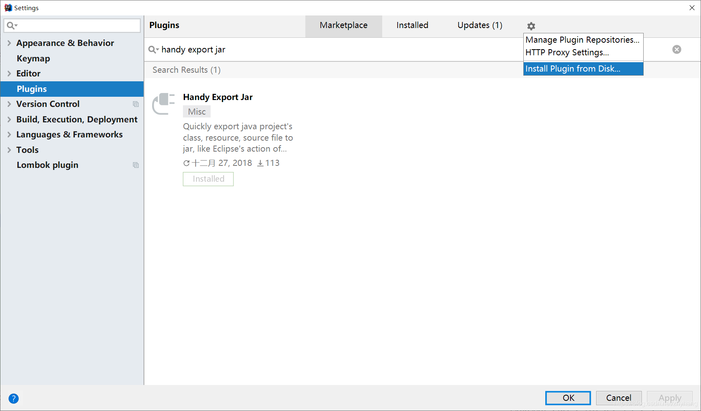
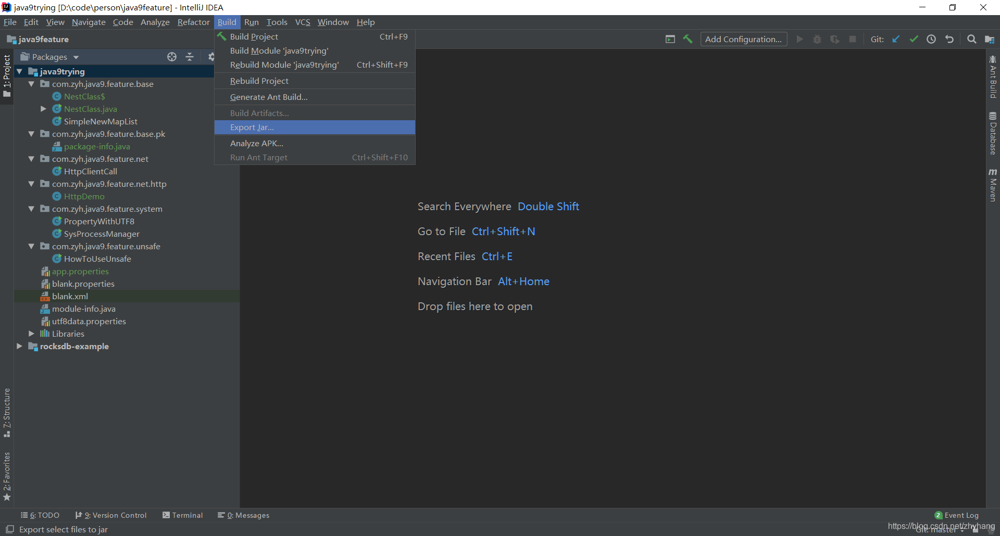
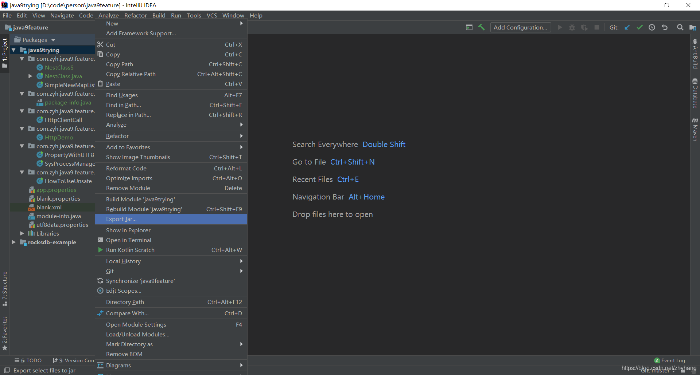
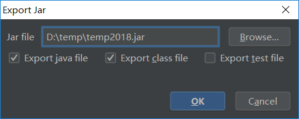
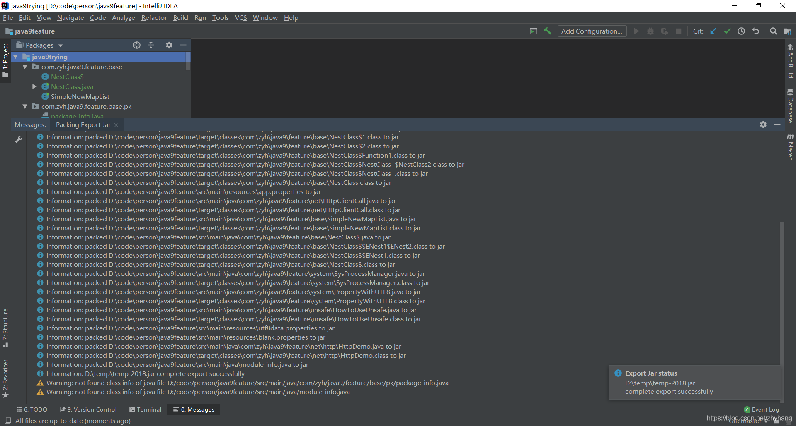

## 背景
使用Eclipse做Java的IDE时，经常要导出某一个类或几个类输出为一个jar包，然后用于补丁打到项目运行环境中，比较方便，可以避免编译整个工程或依赖问题。而在Idea中要做相同的操作，比较麻烦，有些插件也不太好用，因此，去年年底自己写了一个插件，基本与Eclipse的Export功能相同。

## 功能
- Quick and Handy export
- Supports export java, class, resource file in java project classpath and their compiled output directories
- Supports single file or multi-files selection for export
- Supports different scopes export: class, package, module, project
- Supports cross modules export (no duplication selected)
- Supports export files in test directory
- Supports custom setting export file type
- Supports list export jar history in combobox for select
- Supports version 2017.3 and later (include android studio), Jvm 1.8+
- Supports Ultimate and Community Edition

## 安装
- 从idea中直接安装
  - 文件菜单，settings，plugins，从marketplace中搜索handy export jar安装即可。
- 从idea的plugin页面下载手工安装
  - 访问：https://plugins.jetbrains.com/plugin/11438-handy-export-jar
  - 下载最新版本的插件jar文件
  - 在idea的plugins界面中，点击右侧的设置图标，Install Plugin from Disk…

## 使用
- 选中要导出的文件
  - 选择要导出文件，可以是单个，也可多个，甚至是整个module，更甚整个工程。
  - 文件可以包括class、java文件类型。
- 执行导出
  - 然后点击右键或使用Build菜单，选择”Export Jar…“，按照导引导出jar文件，即完成。

## 源代码及问题跟踪
访问：https://github.com/zhyhang/export-jar

## 截图

