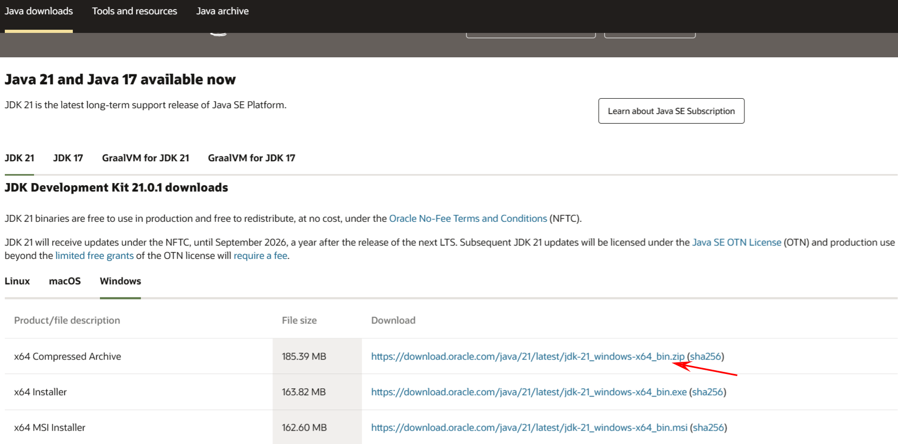

## 下载
[Oracle官网下载地址](https://www.oracle.com/java/technologies/downloads/)

下载完成后解压即可，我这里就解压到 `C:\Users\25810\.jdks`

## 环境变量设置
右键此电脑 -> 属性 -> 高级系统设置 -> 环境变量

添加变量 `JAVA_HOME`，值为JDK的安装路径，如 `C:\Users\25810\.jdks\jdk-21.0.1`

修改变量 `Path` ，添加项 `%JAVA_HOME%\bin`

---
对于多个版本jdk的管理：
[JDKSwitchScriptGen.bat](./JDKSwitchScriptGen.bat)
