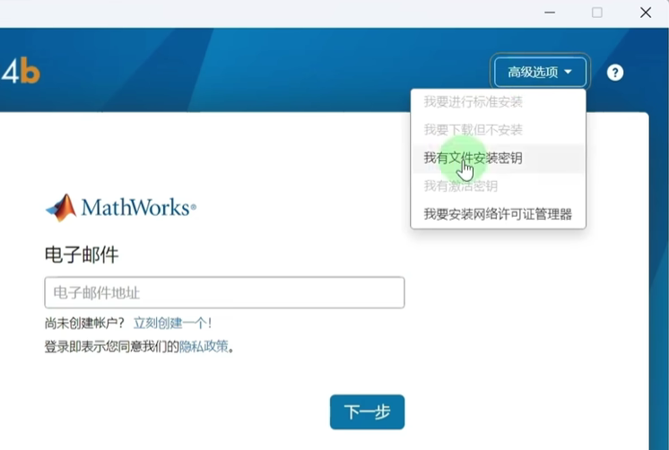
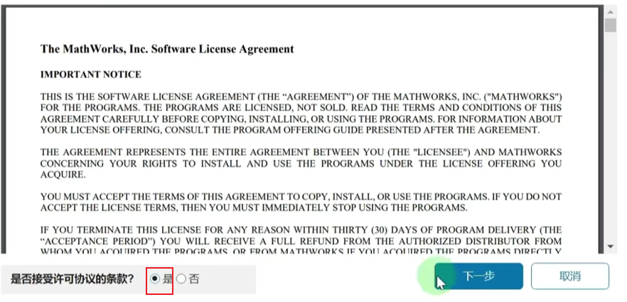
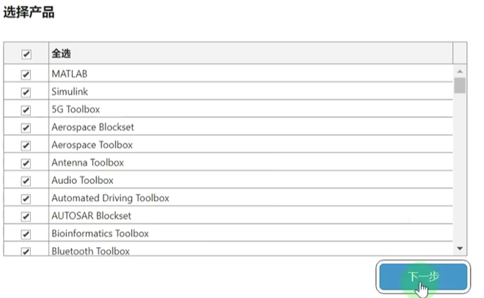
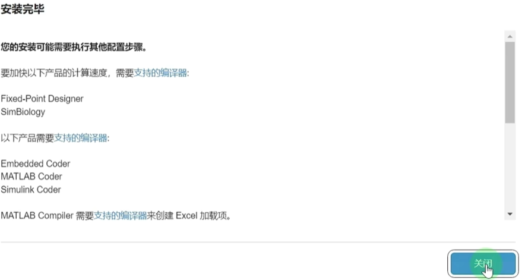
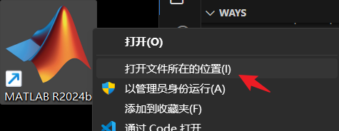
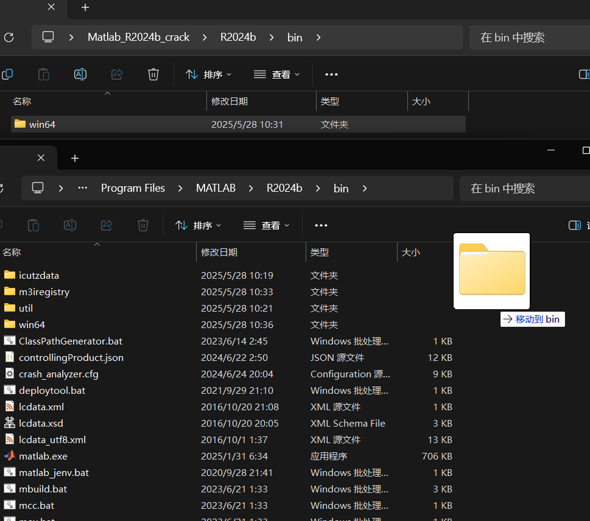
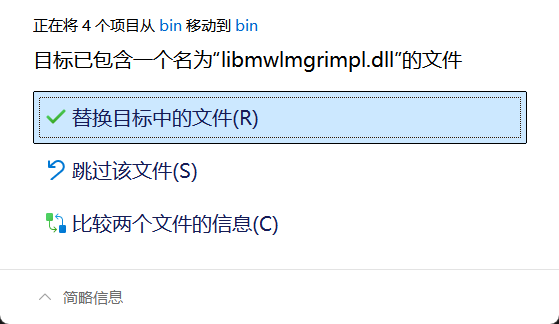
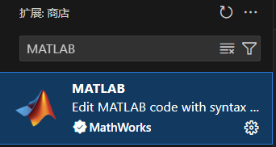
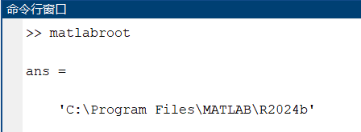
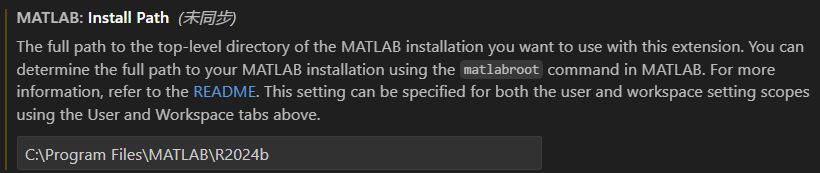

## 安装步骤

密钥见 `key.txt`

许可证见 `R2024b\licenses\license.lic`

安装目录不要有中文，默认就好

产品默认就好，也可以按需选择

勾选快捷方式、取消发送报告

等待安装完成，点击关闭

---
右键桌面图标，打开文件所在位置

将 `R2024b\bin\win64` 复制到安装目录中

## 所需文件下载
通过网盘分享的文件：Matlab_R2024b_crack.zip
链接: https://pan.baidu.com/s/1wVVhUU_JXMtC8EY2F7G8_g?pwd=438q 提取码: 438q 复制这段内容后打开百度网盘手机App，操作更方便哦

## 参考
- [Matlab R2023b (Update6) 软件下载与安装教程](https://www.mr-wu.cn/matlab-2023b-free-download/)

---
在VSCode中使用

