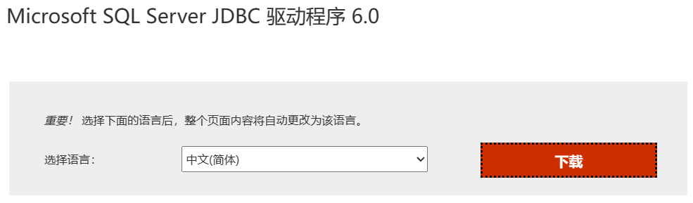
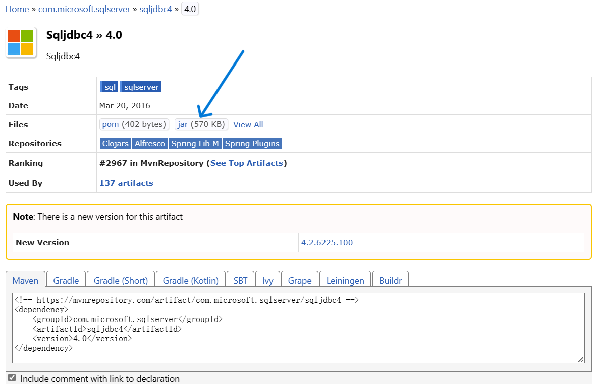

Missing artifact com.microsoft.sqlserver:sqljdbc4:jar:4.0

## 一、直接原因
指定路径下确实没有sqljdbc4.jar文件。

## 二、根本原因
微软不允许以maven的方式直接下载该文件。

## 三、解决办法

### 下载相关库
1. 官网下载
   [Microsoft SQL Server JDBC 驱动程序](https://www.microsoft.com/zh-CN/download/details.aspx?id=11774)
   
2. Maven仓库下载
   [Home » com.microsoft.sqlserver » sqljdbc4 » 4.0](https://mvnrepository.com/artifact/com.microsoft.sqlserver/sqljdbc4/4.0)
   

### 3.2 进入下载库所在的目录

### 3.3 执行以下命令
```bash
mvn install:install-file -Dfile=sqljdbc4-4.0.jar -DgroupId=com.microsoft.sqlserver -DartifactId=sqljdbc4 -Dversion=4.0 -Dpackaging=jar
```

> mvn install:install-file -Dfile=<jar包的绝对路径> -DgroupId=<groupId名> -DartifactId=<artifactId名> -Dversion=<jar版本> -Dpackaging=<文件打包方式>


参考：
- [CSDN-Missing artifact com.microsoft.sqlserver:sqljdbc4:jar:4.0解决，手动安装Microsoft SQL Server JDBC 驱动](https://blog.csdn.net/uhb6577/article/details/85331611)
- [CSDN-sqljdbc4驱动在maven中无法识别的解决办法 爆红 识别不到](https://blog.csdn.net/qq_42704130/article/details/120956900)
