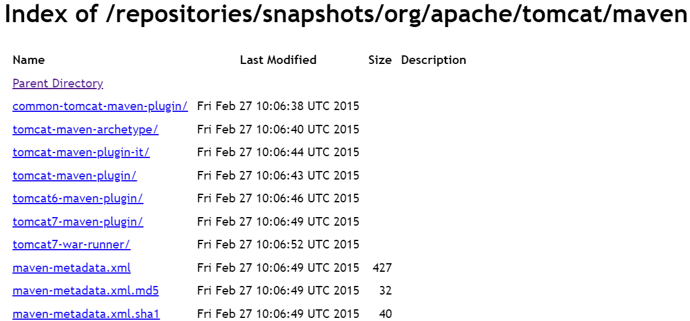

在Maven的中央仓库中根本就没有这个插件:

https://repository.apache.org/content/repositories/snapshots/org/apache/tomcat/maven/



使用如下插件库中的插件：
https://mvnrepository.com/artifact/org.apache.tomcat.maven/tomcat8-maven-plugin/3.0-r1756463

在POM.XML中加入以下内容
```xml
<pluginRepositories>   
    <pluginRepository>   
    <id>alfresco-public</id>    
    <url>https://artifacts.alfresco.com/nexus/content/groups/public</url>   
    </pluginRepository>    
    <pluginRepository>   
    <id>alfresco-public-snapshots</id>    
    <url>https://artifacts.alfresco.com/nexus/content/groups/public-snapshots</url>    
    <snapshots>   
        <enabled>true</enabled>    
        <updatePolicy>daily</updatePolicy>   
    </snapshots>   
    </pluginRepository>    
    <pluginRepository>   
    <id>beardedgeeks-releases</id>    
    <url>http://beardedgeeks.googlecode.com/svn/repository/releases</url>   
    </pluginRepository>   
</pluginRepositories>
```

加入插件依赖
```xml
<plugin>
    <groupId>org.apache.tomcat.maven</groupId>
    <artifactId>tomcat8-maven-plugin</artifactId>
    <version>3.0-r1756463</version>
</plugin>
```