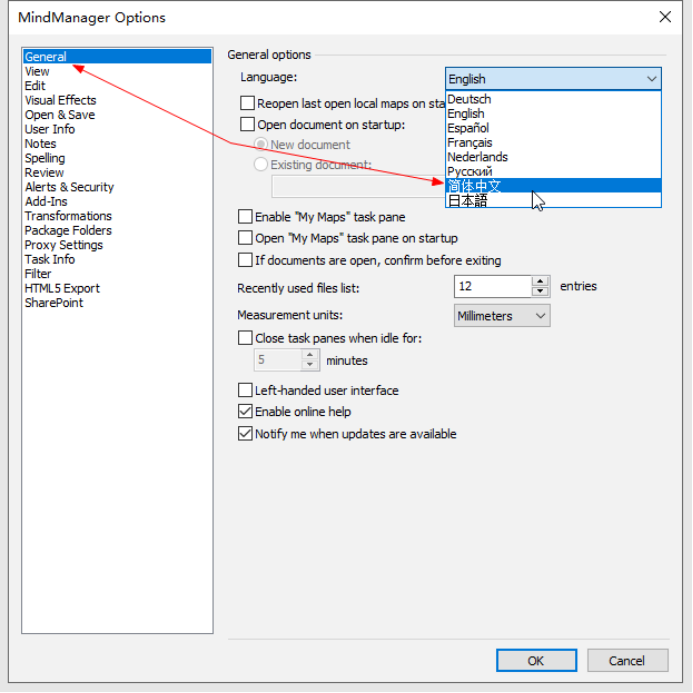

## 安装
双击打开 `MindManager 22x64.msi` 一路下一步即可。

> **安装完成后，先不要打开软件。**

## 激活
将Crack文件夹里面的 `MindManager.exe` 、 `MmApplicationFramework.dll` 这2个文件复制到安装目录替换原来的文件即可。

默认安装目录是：`C:\Program Files\MindManager 22`

## 中文
在 File -> Option 选项卡中选择下图所示的简体中文即可。（重启软件生效）

---
- [MindManager 2022 安装与破解（保姆教程）](https://www.zwnblog.com/archives/mindmanager2022-an-zhuang-yu-po-jie--bao-mu-jiao-cheng-)
- [相关文件下载](https://pan.baidu.com/s/1m0XJXwEv2sQvmSGOBS7pTw?pwd=qi8j) 提取码: qi8j
