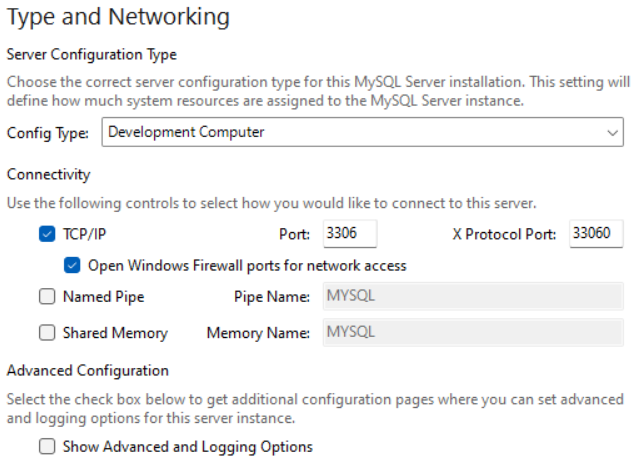
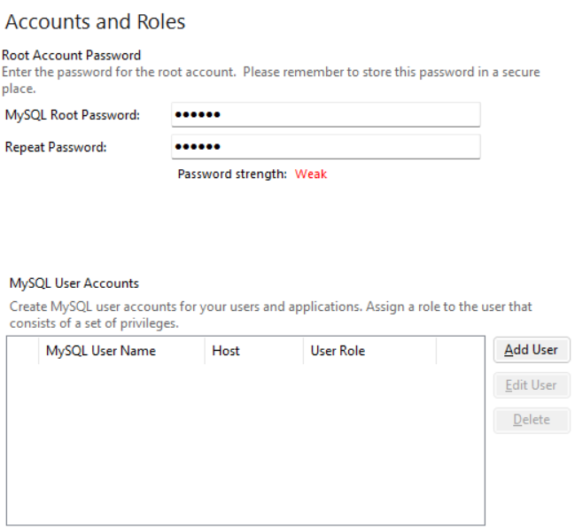
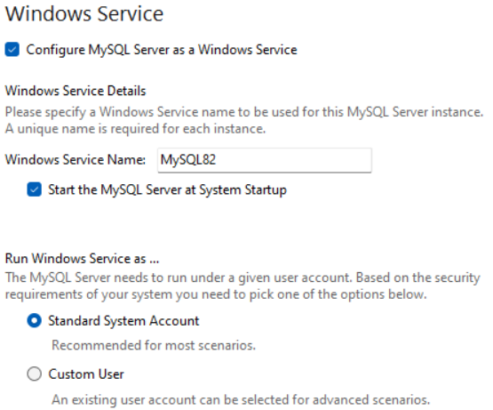

## 下载mysql-8.0.30-winx64.zip
下载地址：https://dev.mysql.com/downloads/mysql/

选择【Windows (x86, 64-bit), MSI Installer】即可

点击【Download】【No thanks, just start my download.】

## 安装
> 一般保持默认就好，除了设置个root密码也不太用改

同意协议、典型安装（当然也可以选自定义设置安装路径）

配置类型和端口

设置root密码、添加用户

注册服务

## 参考
- [Windows MYSQL社区版8.1下载安装（MSI）](https://blog.csdn.net/weixin_68256171/article/details/132107858)
- [mysql-8.0.30-winx64.zip安装配置方法](./Mysql安装.md)
