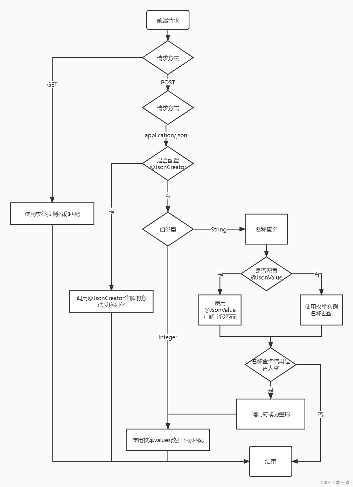

## 使用示例

### 1、pom.xml

```xml
<dependency>
    <groupId>com.baomidou</groupId>
    <artifactId>mybatis-plus-boot-starter</artifactId>
    <version>3.5.4.1</version>
</dependency>
```

### 2、application.yml

新版本已不需要该配置

```yaml
mybatis-plus:
  type-enums-package: com.example.mybatisplusenumsdemo.enumeration
```

### 3、枚举类

```java
@AllArgsConstructor
@Getter
// @JsonFormat(shape= JsonFormat.Shape.OBJECT)
public enum GenderEnum {

    MALE(1, "男"),
    FEMALE(0, "女"),
    UNKNOWN(-1, "未知");

    @EnumValue // 标记数据库的存储字段
    private final Integer code;

    @JsonValue // 标记序列化时的值
    private final String name;

    @JsonCreator // 标记反序列化时的构造方法（如果没有这个注解，反序列化时会使用@JsonValue标记的字段进行映射）
    public static GenderEnum getEnum(Integer code) {
        for (GenderEnum genderEnum : GenderEnum.values()) {
            if (genderEnum.getCode().equals(code)) {
                return genderEnum;
            }
        }
        return null;
    }

}
```

### 4、实体类

```java
@TableName(value = "t_user")
@Data
public class User implements Serializable {
    /**
     *
     */
    @TableId(value = "id", type = IdType.AUTO)
    private Long id;

    /**
     *
     */
    @TableField(value = "uname")
    private String uname;

    /**
     *
     */
    @TableField(value = "gender")
    private GenderEnum gender;

    @TableField(exist = false)
    private static final long serialVersionUID = 1L;
}
```

## 序列化（后端->前端）

根据实际需要，使用 `@JsonValue` 标记字段或者 `@JsonFormat(shape= JsonFormat.Shape.OBJECT)` 标记枚举类。
二者的区别如下：

### 1、@JsonFormat(shape= JsonFormat.Shape.OBJECT)

```json
"gender": {
    "code": 1,
    "name": "男"
}
```

### 2、@JsonValue

若枚举类未标记 `@JsonFormat(shape= JsonFormat.Shape.OBJECT)`，字段标记 `@JsonValue` （这里 name 字段标记了 `@JsonValue`），则序列化后的结果为：

```json
"gender": "男"
```

## 反序列化（前端->后端）

> **不同的请求方式和传参方式，反序列化处理逻辑不一样**

### `POST请求(application/json)方式` 走 `jackson` 反序列化逻辑



### 其余方式
其它方式，包括 `GET请求` 、 `POST请求(application/x-www-form-urlencoded)方式` 、 `POST请求(multipart/form-data)方式` 不走 `jackson` 反序列化逻辑（默认使用枚举实例 `name()` 值做匹配 **区分大小写**）


---
- [参考文章（详细，含源码）](https://blog.csdn.net/ory001/article/details/124515027)
