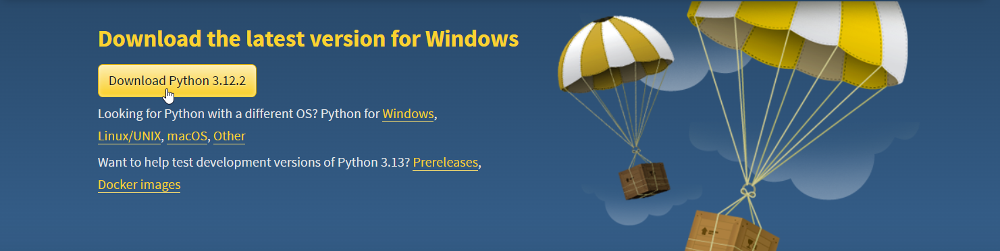
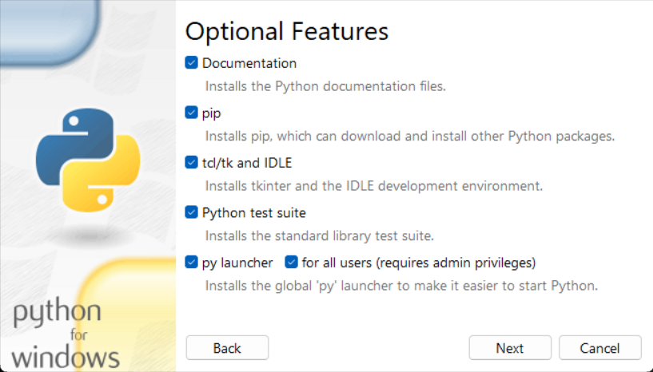
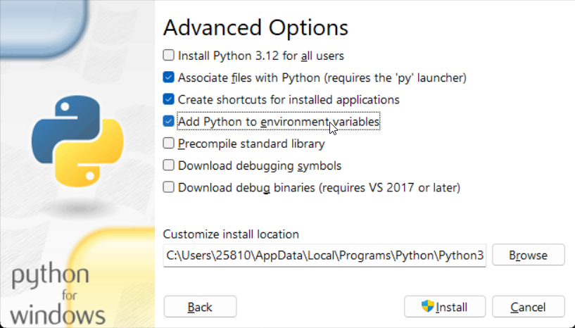
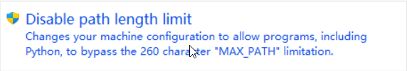

## 下载
- [官网](https://www.python.org/)
  - [下载页](https://www.python.org/downloads/)

## 安装（默认）
双击打开，勾选 ！`Add Python 3.9 to PATH`，点击 `Install Now`

## 安装（自定义）
双击打开，选择 `Customize installation` 自定义安装

全部勾选，点击 `Next`

勾选 ！`Add Python to environment variables`

在 ！`Customize install location` 中选择安装路径，点击 `Install` 即可。

## 安装完成
建议点击 ！`Disable path length limit` ，避免后续程序运行时，因为路径超长而出现报错。

> [最大路径长度限制](https://learn.microsoft.com/zh-cn/windows/win32/fileio/maximum-file-path-limitation?tabs=registry)

## 验证
打开 命令行 输入 `python -V`，显示版本号即安装成功。

## 链接
- [Python3 文档（简体中文）](https://docs.python.org/zh-cn/3/)
- [知乎-全网最详细的Python安装教程（Windows）](https://zhuanlan.zhihu.com/p/344887837)
- [CSDN-Python环境安装配置tips](https://blog.csdn.net/Mr_Aspirin/article/details/128034147)
