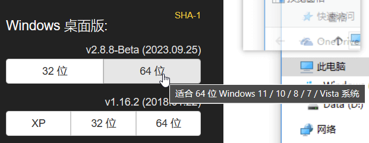

## 下载
[官网](https://zh.snipaste.com/)



解压到合适的文件夹，然后运行`Snipaste.exe`即可。


## 设置（基于v2.8.8）
修改 `DIR/config.ini`
```ini
[General]
first_run=false
startup_fix=2
last_save_folder=C:/Users/25810/Downloads
start_on_boot=true
as_admin=true

[Output]
quick_save_path=C:/Users/25810/Pictures/Snipaste快速保存/Snipaste_$yyyy-MM-dd_HH-mm-ss$.png

[Snip]
ask_for_confirm_on_esc=false
```

> 这里 `25810` 是我的用户名，需要根据自己的用户名修改。
