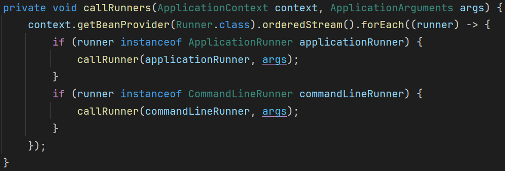
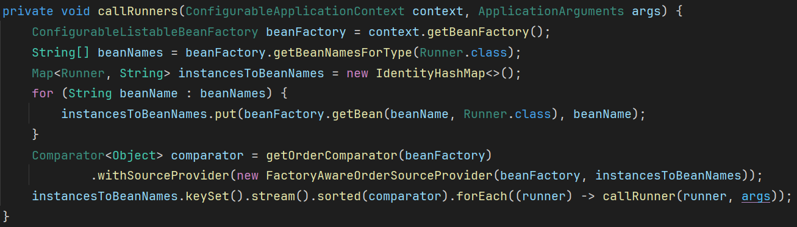

## 报错信息
```shell
Error starting ApplicationContext. To display the condition evaluation report re-run your application with 'debug' enabled.
2024-05-11T12:20:38.325+08:00 ERROR 21352 --- [           main] o.s.boot.SpringApplication               : Application run failed

org.springframework.beans.factory.BeanNotOfRequiredTypeException: Bean named 'ddlApplicationRunner' is expected to be of type 'org.springframework.boot.Runner' but was actually of type 'org.springframework.beans.factory.support.NullBean'
	at org.springframework.beans.factory.support.AbstractBeanFactory.adaptBeanInstance(AbstractBeanFactory.java:407) ~[spring-beans-6.0.15.jar:6.0.15]
	at org.springframework.beans.factory.support.AbstractBeanFactory.doGetBean(AbstractBeanFactory.java:388) ~[spring-beans-6.0.15.jar:6.0.15]
	at org.springframework.beans.factory.support.AbstractBeanFactory.getBean(AbstractBeanFactory.java:204) ~[spring-beans-6.0.15.jar:6.0.15]
	at org.springframework.boot.SpringApplication.callRunners(SpringApplication.java:762) ~[spring-boot-3.1.7.jar:3.1.7]
	at org.springframework.boot.SpringApplication.run(SpringApplication.java:331) ~[spring-boot-3.1.7.jar:3.1.7]
	at org.springframework.boot.SpringApplication.run(SpringApplication.java:1321) ~[spring-boot-3.1.7.jar:3.1.7]
	at org.springframework.boot.SpringApplication.run(SpringApplication.java:1310) ~[spring-boot-3.1.7.jar:3.1.7]
	at com.bus.management.BusManagementApplication.main(BusManagementApplication.java:12) ~[classes/:na]
```

## 问题原因
`DdlApplicationRunner` 未配置任何 `IDdl` 时返回的是 `null`，被封装成 `NullBean`。

SpringBoot3.1.6-版本中，`callRunners` 方法使用 `context.getBeanProvider(Runner.class).orderedStream().forEach` 遍历 `Runner` 类型的 `Bean` 在 `orderedStream` 时会过滤 `NullBean`，`DdlApplicationRunner` 返回的 `NullBean` 被过滤掉了。


SpringBoot3.1.7+版本中，`callRunners` 方法使用 `beanFactory.getBean(beanName, Runner.class)` 获取 `Runner` 类型的 `Bean` ，`DdlApplicationRunner` 返回的 `NullBean` 与最终需要的类型 `Runner` 不匹配。


## 解决方案

### 方案一
使用更低的 `SpringBoot` 版本，如 `SpringBoot3.1.6`。

### 方案二（推荐）
使用更高的 `MyBatisPlus` 版本，如 `MyBatisPlus3.5.5`。

### 方案三
手动向 `Spring` 容器中添加 `DdlApplicationRunner` 类型的 `Bean`。
```java
@Configuration
public class DdlApplicationRunnerConfig {
    @Bean
    public DdlApplicationRunner ddlApplicationRunner(@Autowired(required = false) List<IDdl> ddlList) {
        return new DdlApplicationRunner(ddlList);
    }
}
```

---
- [Springboot3整合myBatisplus报错：Bean named ‘ddlApplicationRunner‘ is expected to be of type ‘org.sprin_bean named 'ddlapplicationrunner' is expected to b-CSDN博客](https://blog.csdn.net/weixin_46211609/article/details/135552632)
- [SpringBoot 3.2.1 启动报错 · Issue #5867 · baomidou/mybatis-plus](https://github.com/baomidou/mybatis-plus/issues/5867)
