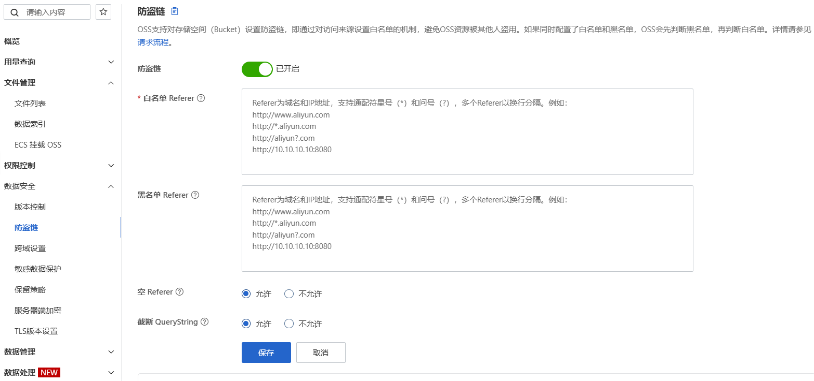

## 问题描述
单独将图片路径复制在浏览器中，可以正常打开。页面标签的图片和css中的背景图片都报403错误。


## 解决方案

### 解决1：img标签中的图片显示问题
在 `index.html` 中添加：
```html
<meta name="referrer" content="no-referrer">
```

### 解决2：css中的图片显示问题

在[阿里云oss管理](https://oss.console.aliyun.com/bucket)中找到存放图片的库，找到 `数据安全 -> 防盗链`，添加 `Referer` 白名单，将你的域名/ip添加进去。



---
- [vue 在页面中使用阿里云oss网络图片，解决图片不显示的问题](https://blog.csdn.net/qq_35057009/article/details/129240296)
