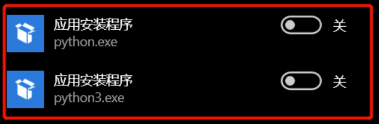

## 背景介绍
在命令控制行中输入python想使用Python环境，却打开了微软自带的应用商店。

## 原因分析
由于多次安装过python环境，使得环境变量产生了问题，命令行无法找到合适的python启动路径，导致排位靠后的store启动。

## 解决思路

### 方法一：
将系统和用户的环境变量中的 `%USERPROFILE%\AppData\Local\Microsoft\WindowsApps` 都删除掉。并将现在的python路径添加到系统变量中。

### 方法二
win10菜单搜索【管理应用执行别名】关闭下面两个按钮【应用安装程序】

