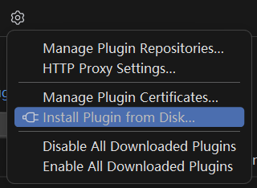

# 解决 Win11 微软拼音输入法下 JetBrains IDE Shift+F6 失效的问题
如果你使用 Win11 系统下的微软拼音输入法，同时又在使用 JetBrains 系列的 IDE，你可能会发现 "Refactor -> Rename..." 功能对应的默认快捷键 Shift+F6 按了之后没有反应，但通过菜单执行这个操作是正常的。这个问题目前基本可以确定是微软拼音输入法引起的。

目前在 JetBrains 和 Windows 社区都已经有较多关于此问题的反馈，如 [这个](https://answers.microsoft.com/zh-hans/windows/forum/all/%E5%BE%AE%E8%BD%AF%E6%8B%BC%E9%9F%B3%E8%BE%93/456b9c2a-b4cd-4add-b84f-4c174afced32?page=15)。不过微软似乎迟迟没有去处理这个问题。

搜索之后找到两种解决方法：

## 使用旧版微软拼音输入法

1. 在任务栏中输入法图标上右键，点击“设置”，或者在系统设置中进入“时间和语言 -> 语言和区域 -> 微软拼音输入法”设置项。
2. 点击进入“常规”类别，滚动到页面底部，找到“兼容性 -> 使用以前版本的微软拼音输入法”开关，打开此开关。
3. 系统会弹出对话框要求你确认是否更改。确认之后，你的输入法样式会退回到 Win10 版本，上述问题解决。

## 使用社区提供的修补插件

但是，Win11 的输入法样式比 Win10 的漂亮多了。仅仅因为这个问题就更改全局的输入法样式，不免有些遗憾。

于是我发现了这个仓库 [https://github.com/loliball/imefix](https://github.com/loliball/imefix)

### 自动安装

在任何 JetBrains IDE 中点击 “File -> Settings...”，打开设置，选择“Plugins”标签。在“Marketplace”中搜索“Imefix”，点击安装，然后重启 IDE，问题解决。

### 手动安装

到 Release 中下载 .zip 包，然后在任何 JetBrains IDE 中点击 “File -> Settings...”，打开设置，选择“Plugins”标签，然后点击齿轮图标，再点击“Install Plugin from Disk...”：

---
- [解决 Win11 微软拼音输入法下 JetBrains IDE Shift+F6 失效的问题 - Eslzzyl - 博客园](https://www.cnblogs.com/eslzzyl/p/18146945)
