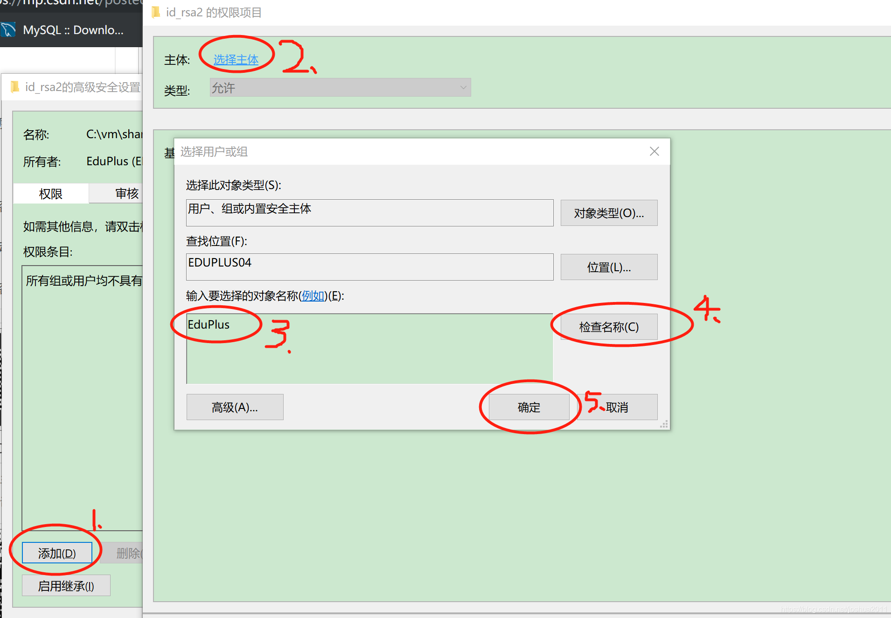

## 报错信息
```powershell
PS C:\vm\share_vm> ssh -i .\id_rsa  root@192.168.56.101

@@@@@@@@@@@@@@@@@@@@@@@@@@@@@@@@@@@@@@@@@@@@@@@@@@@@@@@@@@@
@         WARNING: UNPROTECTED PRIVATE KEY FILE!          @
@@@@@@@@@@@@@@@@@@@@@@@@@@@@@@@@@@@@@@@@@@@@@@@@@@@@@@@@@@@
Permissions for '.\\id_rsa' are too open.
It is required that your private key files are NOT accessible by others.
This private key will be ignored.
Load key ".\\id_rsa": bad permissions
root@192.168.56.101: Permission denied (publickey,gssapi-keyex,gssapi-with-mic).
```

如果是在linux下，`chmod 600` 即可。


## Windows 解决方法

### 1. 得到当前用户名
powershell: `$env:username`

cmd: `whoami`

### 2. 删除已有权限条目
右键私钥文件，以此选择属性->安全->高级，进入下面的界面


1. 禁用继承，选择 `将已继承的权限转换为此对象的显式权限。`
   

2. 删除所有的【权限条目】
   

### 3. 添加新的权限条目
1. 更改所有者
   

   **EduPlus是前面通过PowerShell或cmd查出的当前用户名。**

   > 因为Windows的原因，确定之后所有者不一定会显示成下面的样子，但是一般不影响后续操作。
   > 

2. 添加权限条目
   

3. 给予当前用户完全控制的权限
   

最终效果：


## 参考
- [CSDN-真正解决 windows OpenSSH WARNING: UNPROTECTED PRIVATE KEY FILE!](https://blog.csdn.net/joshua2011/article/details/90208741)
