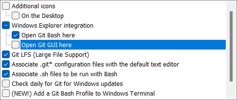
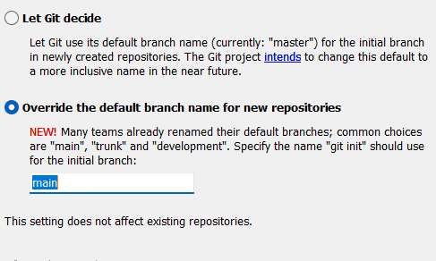
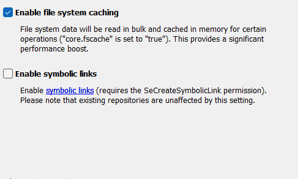
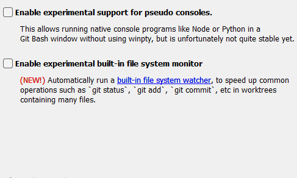
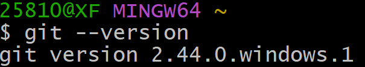
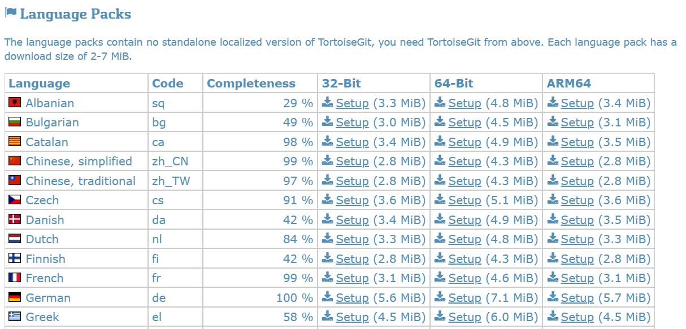

## 下载
- [Git官网](https://git-scm.com/)
  - [下载页](https://git-scm.com/download/win)


## 安装
查看 GNU 协议，点击下一步。

选择安装路径（尽量是非中文并且没有空格的目录）。


**取消勾选`Git GUI Here`**，这个功能几乎用不到。


创建开始菜单快捷方式，默认即可。


选择git的默认编辑器，默认 `Vim` 即可。


设置默认分支名，默认即可。（不过现在很多的仓库默认分支名是 `main`，这里我**选择设置为 `main`**）。


是否调整环境变量，**推荐选择 `Use Git from Git Bash only`**。（如果真有相关需求也可以选择 `Git from the command line and also from 3rd-party software` ，其实后面也可以手动添加或者使用类似 `posh-git` 等工具来实现）


选择SSH、HTTPS的方式，默认即可。


配置 Git 文件的行末换行符，Windows 使用 CRLF，Linux 使用 LF，选择第一个自动转换。


选择 Git 终端类型，选择默认的 Git Bash 终端。


选择 Git pull 合并的模式，默认即可。


选择 Git 的凭据管理器，选择默认的跨平台的凭据管理器。


其他配置，默认即可。


实验室功能，不要勾选，点击 `Install` 开始安装。


点击 Finsh 按钮，Git 安装成功！

右键任意位置，在右键菜单里选择 `Git Bash Here` 即可打开 Git Bash 命令行终端。

输入 `git --version` 查看 git 版本。



## 设置用户签名

```shell
git config --global user.name 用户名
git config --global user.email 邮箱
```

示例：

```shell
git config --global user.name "通晓宇宙"
git config --global user.email "2581011320@qq.com
```

说明：
- 签名的作用是区分不同操作者身份。用户的签名信息在每一个版本的提交信息中能够看到，以此确认本次提交是谁做的。Git 首次安装必须设置一下用户签名，否则无法提交代码。
- `※注意`：这里设置用户签名和将来登录 GitHub（或其他代码托管中心）的账号没有任何关系。


## TortoiseGit
- [TortoiseGit官网](https://tortoisegit.org/)
  - [下载页](https://tortoisegit.org/download/)

安装一路 `Next` 即可。

下载页可以下载到 `TortoiseGit` 的中文语言包，选择对应的语言包下载即可。

