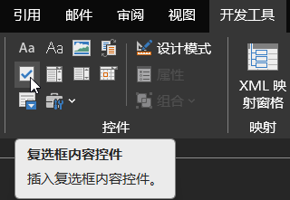

Word/WPS输入带钩带叉方框

## 一、<kbd>Alt</kbd> 快捷键输入

### 法一：先输入数字，再按 <kbd>Alt</kbd> + <kbd>X</kbd>
| 输入 | 对应字符 |
| ---- | -------- |
| 2610 | ☐        |
| 2611 | ☑        |
| 2612 | ☒        |

### 法二：按住 <kbd>Alt</kbd> 键，输入数字
| 输入                  | 对应字符 |
| --------------------- | -------- |
| <kbd>Alt</kbd> + 9744 | ☐        |
| <kbd>Alt</kbd> + 9745 | ☑        |
| <kbd>Alt</kbd> + 9746 | ☒        |

## 二、复选框
插入复选框

修改控件属性

修改选中标记

使用字体 `Segoe UI Symbol` 选择字符代码 `2611` 的字符

## 三、插入符号
点击菜单【插入】-【符号】-【其他符号】

使用字体 `Segoe UI Symbol` 选择字符代码 `2611` 的字符

---
- [在word里快速输入打钩方框☑，这5种方法都能用！ - 知乎](https://zhuanlan.zhihu.com/p/609829905)
- [在 Word 中插入 ASCII 或 Unicode 字符代码 - Microsoft 支持](https://support.microsoft.com/zh-cn/office/%E5%9C%A8-word-%E4%B8%AD%E6%8F%92%E5%85%A5-ascii-%E6%88%96-unicode-%E5%AD%97%E7%AC%A6%E4%BB%A3%E7%A0%81-e97306f7-00c1-490d-9920-c924ca443f87)
- [Word技巧：ALT+X快捷键_51CTO博客_alt+x是什么快捷键](https://blog.51cto.com/u_15127569/4219057)

