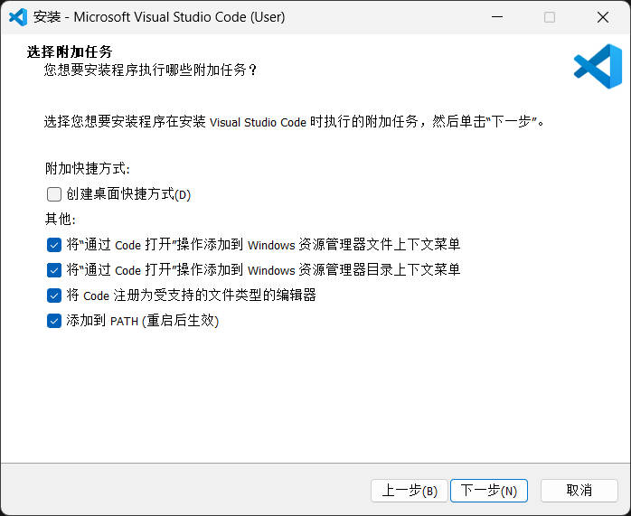

## 下载
[官网](https://code.visualstudio.com/)
- [下载页](https://code.visualstudio.com/Download)

## 安装
下一步下一步即可，**将VSCode添加到资源管理器上下文菜单可以方便以后使用**：

[VSCode使用一段时间后会占用大量C盘空间](./清理VSCode缓存.md)，可以使用 [CleanVSCode.bat](./CleanVSCode.bat) 脚本清理，为方便使用，可以将其置于 `~/.vscode/` 下。

---
**VSCode现在可以登录Github账号保存设置和扩展，本文件提供个人目前的一些设置，不会及时更新。（我的意思是说下面或许不用看了）**

## 配置
[VSCodeUserSettings.json](./VSCodeUserSettings.json)

## 扩展推荐（欢迎补充）
| 插件名                                                               | 说明                                         |
| -------------------------------------------------------------------- | -------------------------------------------- |
| Chinese (Simplified) (简体中文) Language Pack for Visual Studio Code | 中文（简体）语言包                           |
| vscode-icons                                                         | 文件/目录图标主题                            |
| Error Lens                                                           | 在代码中直接高亮错误与警告                   |
| Git Graph                                                            | 图形化查看 Git 提交记录与分支                |
| Lingma - Alibaba Cloud AI Coding Assistant                           | 阿里云灵码 AI 编程助手                       |
| Path Intellisense                                                    | 自动补全文件路径                             |
| Markdown All in One                                                  | Markdown 编辑增强工具（快捷键、目录生成等）  |
| Markdown Preview Enhanced                                            | Markdown 高级预览（支持图表、公式等）        |
| Office Viewer                                                        | 在 VS Code 中预览 Word/Excel/PPT             |
| Image preview                                                        | 在编辑器中预览图片                           |
| Rainbow CSV                                                          | CSV 高亮、列对齐和校验工具                   |
| Live Server                                                          | 启动本地开发服务器、实时预览 HTML            |
| ESLint                                                               | JavaScript/TypeScript 代码规范检查           |
| Prettier - Code formatter                                            | 代码格式化工具                               |
| Template String Converter                                            | 输入${}自动把字符串转成模板字符串            |
| Vue (Official)                                                       | Vue 官方扩展（语法高亮/语言服务）            |
| vue-helper                                                           | Vue 辅助工具，提供代码片段与常用模板         |
| C/C++                                                                | C/C++ 编译、调试与 IntelliSense              |
| Extension Pack for Java                                              | Java 开发扩展包（语言支持、调试、构建工具）  |
| Spring Boot Extension Pack                                           | Spring Boot 开发支持（运行、调试、配置跳转） |
| Python                                                               | Python 基础开发支持                          |
| Black Formatter                                                      | Python Black 格式化工具                      |
| Jupyter                                                              | 在 VS Code 中运行/编辑 Jupyter Notebook      |
