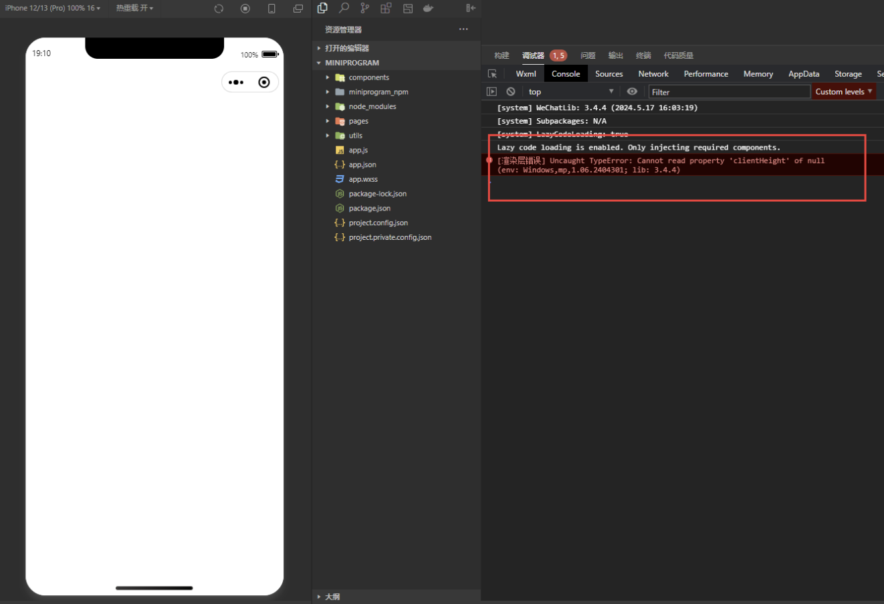
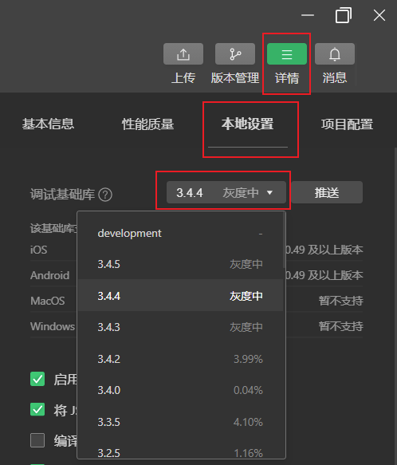

## 问题
在代码上没写过 `clientHeight`，却在运行上报错
```
[渲染层错误] Uncaught TypeError: Cannot read property 'clientHeight' of null
```




## 解决
修改调试基础库版本（修改为任意版本即可）。

微信开发者工具 -> 详情（右上角） -> 本地设置 -> 调试基础库



---
- [渲染层错误-Cannot_read_property_'clientHeight'_of_null | 微信开放社区](https://developers.weixin.qq.com/community/develop/article/doc/000e8038d78600faba819c2f466813)
